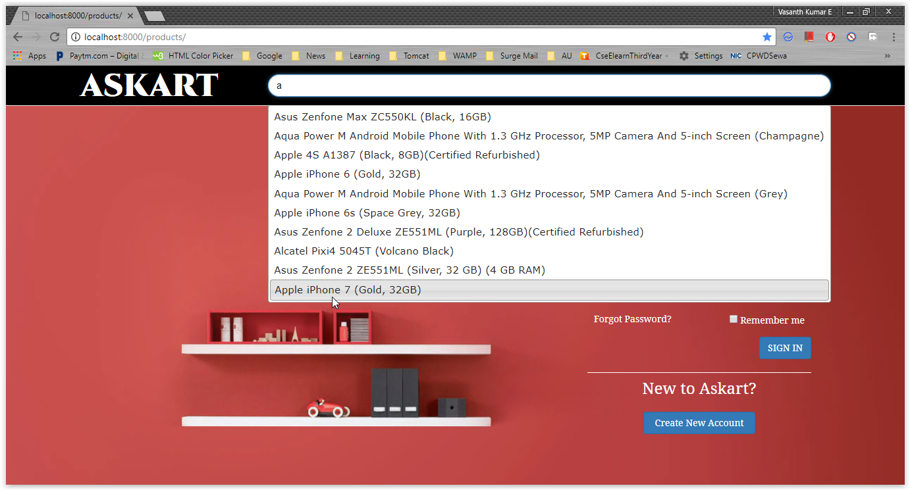
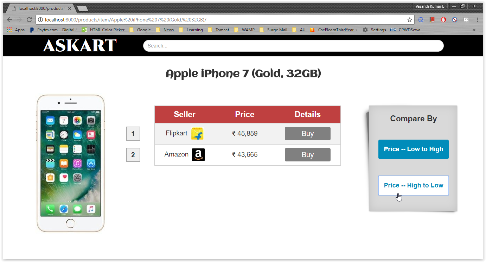
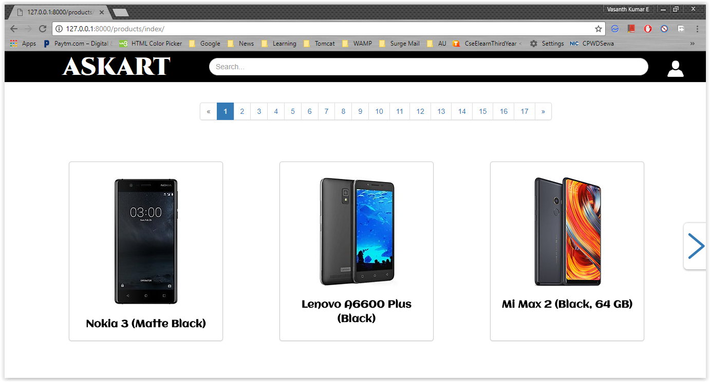
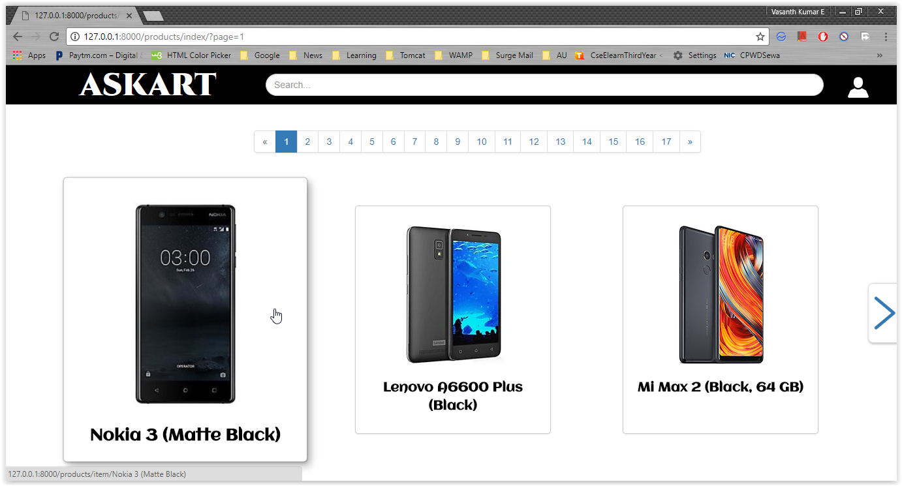
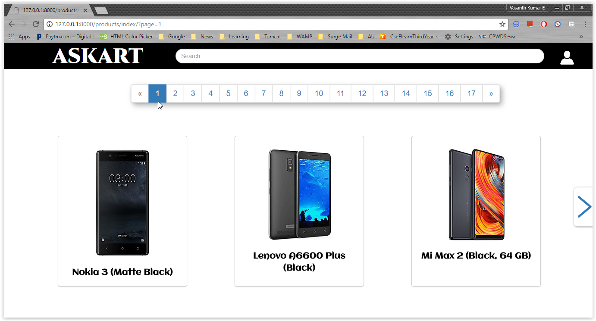
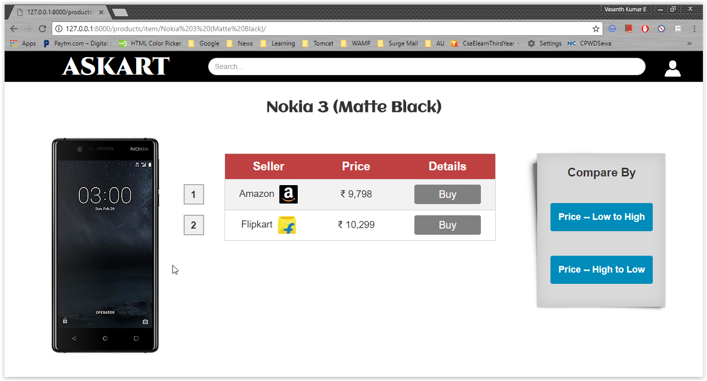

# E-Commerce Price Comparator System

## Introduction

E-Commerce Price Comparator System is a web application which allows users to do quick, practical and cost-efficient shopping all at one stop. It paves the way for the user to know the prices of a queried product being sold on  most popular e-commerce websites like amazon, flipkart, snapdeal etc.,

## Screenshots

<h3 align="center">Home Page</h3>

&nbsp;&nbsp;&nbsp;&nbsp;&nbsp;&nbsp;&nbsp;&nbsp;

<h3 align="center">Queried Mobile Page</h3>

&nbsp;&nbsp;&nbsp;&nbsp;&nbsp;&nbsp;&nbsp;&nbsp;

&nbsp;&nbsp;&nbsp;&nbsp;&nbsp;&nbsp;&nbsp;&nbsp;

<h3 align="center">Mobile Collection Page</h3>

&nbsp;&nbsp;&nbsp;&nbsp;&nbsp;&nbsp;&nbsp;&nbsp;

&nbsp;&nbsp;&nbsp;&nbsp;&nbsp;&nbsp;&nbsp;&nbsp;
